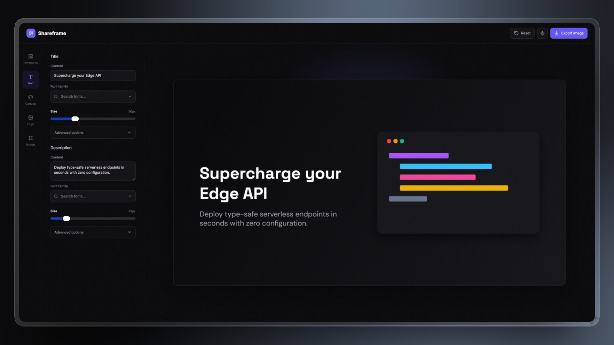

<div align="center">



# Shareframe

**A fast, 100% client-side Open Graph image editor for the browser.**  
Create and export clean, pixel-perfect **1200 × 630** social preview images in under 60 seconds.

<br />

<p align="center">
  <a href="https://react.dev"></a>
  <a href="https://www.typescriptlang.org"></a>
  <a href="https://vite.dev"></a>
  <a href="https://tailwindcss.com"></a>
  <a href="https://developer.mozilla.org/en-US/docs/Web/API/Canvas_API"></a>
  
</p>

</div>

---

## ✨ Features

- 🎨 **Background Styling** — Solid color presets, custom HSL/HEX color picker, and curated gradient presets.
- 📦 **Curated Templates** — 11 built-in templates across categories like *SaaS*, *Blog*, and *Changelog* with tag filters.
- 🖼️ **Logo Integration** — Upload custom PNG, SVG, or WebP logos with intuitive scale and positioning controls.
- ✍️ **Typography Control** — Independent font family, size, color, and weight settings for titles and descriptions.
- ⚡ **Live Canvas Preview** — Instant 1200×630 preview powered by an sRGB Canvas 2D / OffscreenCanvas worker pipeline.
- 📥 **Flexible Export** — Full-resolution exports to **PNG**, **JPG**, and **WebP** directly in your browser.

---

## 🚀 Quick Start

```bash
git clone https://github.com/ohwiredev/shareframe.git
cd shareframe
npm install
npm run dev
```

Visit `http://localhost:5173` to start creating Open Graph images.

---

## 📜 Commands

- `npm run dev` — Start the local development server with HMR
- `npm run build` — Type-check and build the production bundle
- `npm run lint` — Lint code with Biome
- `npm run format` — Auto-format code with Biome
